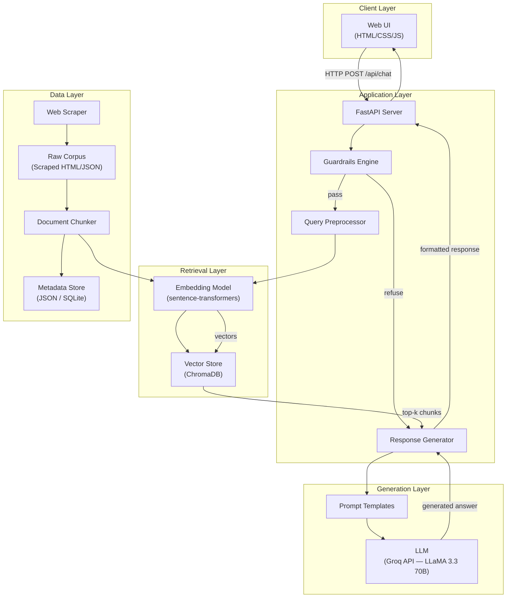
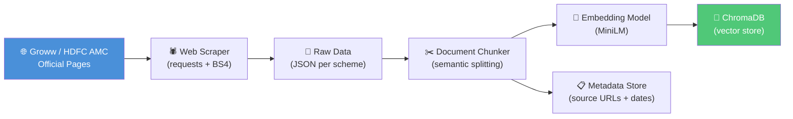
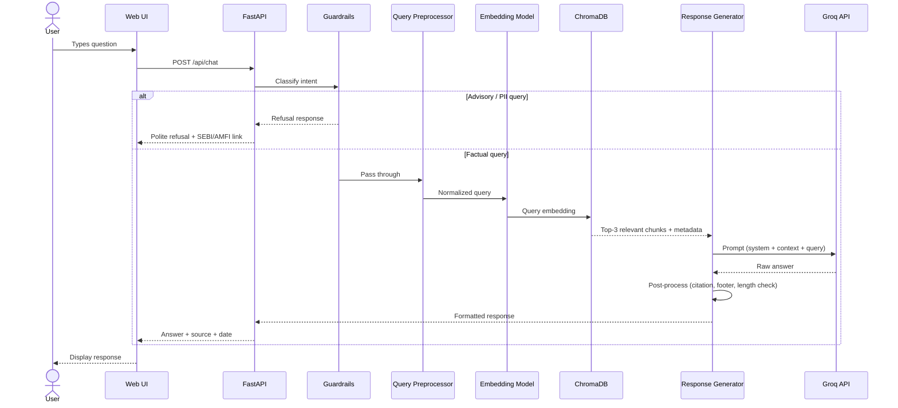
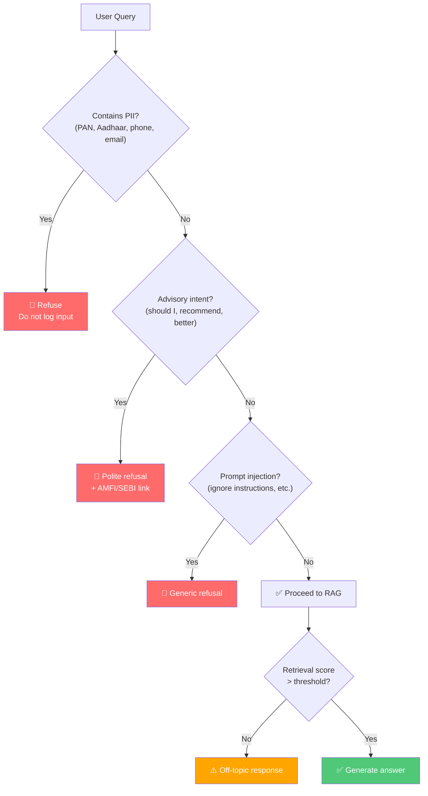
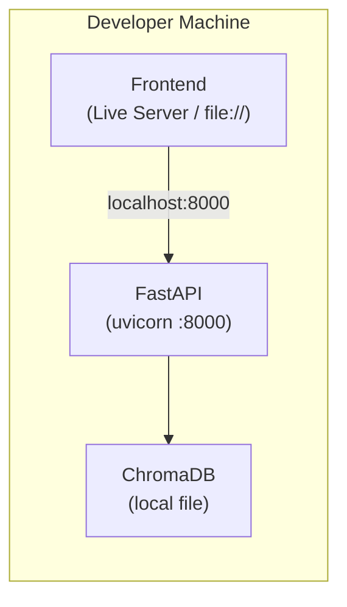

# Architecture: Mutual Fund FAQ Assistant

> **Version:** 1.0  
> **Last Updated:** 2026-08-23  
> **Status:** Proposed  
> **Reference:** [problemStatement.md](file:///Users/shaguftagurmukhdas/Downloads/chatbot/docs/problemStatement.md)

---

## Table of Contents

1. [System Overview](#1-system-overview)
2. [High-Level Architecture](#2-high-level-architecture)
3. [Component Breakdown](#3-component-breakdown)
4. [Data Ingestion Pipeline](#4-data-ingestion-pipeline)
5. [RAG Workflow (Query Path)](#5-rag-workflow-query-path)
6. [Guardrails & Safety Layer](#6-guardrails--safety-layer)
7. [Technology Stack](#7-technology-stack)
8. [API Design](#8-api-design)
9. [User Interface Design](#9-user-interface-design)
10. [Directory Structure](#10-directory-structure)
11. [Deployment Architecture](#11-deployment-architecture)
12. [Observability & Logging](#12-observability--logging)
13. [Security & Privacy](#13-security--privacy)
14. [Limitations & Trade-Offs](#14-limitations--trade-offs)

---

## 1. System Overview

The Mutual Fund FAQ Assistant is a **Retrieval-Augmented Generation (RAG)** system that answers factual questions about HDFC mutual fund schemes. It combines a vector-based retrieval layer with a large language model (LLM) to produce concise, source-cited, facts-only responses.

### Design Principles

| Principle | Description |
|---|---|
| **Facts Only** | Never generate opinions, advice, or recommendations |
| **Source-Backed** | Every response carries exactly one citation link |
| **Minimal & Transparent** | Short answers (≤ 3 sentences), clear disclaimers |
| **Privacy First** | Zero collection of PII — no PAN, Aadhaar, OTPs, emails, or phone numbers |
| **Compliance Aware** | Refuse advisory queries; link to SEBI / AMFI for education |

---

## 2. High-Level Architecture



### Data Flow Summary

1. **Ingestion (offline):** Scrape → Clean → Chunk → Embed → Store in Vector DB
2. **Query (online):** User Query → Guardrails Check → Embed Query → Retrieve Top-K → Generate Answer → Format Response

---

## 3. Component Breakdown

### 3.1 Web Scraper (`scraper/`)

| Aspect | Detail |
|---|---|
| **Purpose** | Extracts mutual fund data from official Groww pages for the 5 selected HDFC schemes |
| **Sources** | Groww scheme pages, HDFC AMC factsheets, AMFI NAV data |
| **Output** | Structured JSON files per scheme containing: expense ratio, exit load, min SIP, lock-in, riskometer, benchmark, fund manager, AUM |
| **Tool** | `requests` + `BeautifulSoup` (static pages) or `Playwright` (JS-rendered pages) |
| **Schedule** | Manual re-run; timestamp stored per source for "Last updated" footer |

### 3.2 Document Chunker (`ingestion/chunker.py`)

| Aspect | Detail |
|---|---|
| **Strategy** | Semantic chunking by section (e.g., one chunk per FAQ field: expense ratio, exit load, etc.) |
| **Chunk Size** | 200–500 tokens per chunk |
| **Overlap** | 50 tokens overlap between adjacent chunks |
| **Metadata per Chunk** | `scheme_name`, `field_type`, `source_url`, `scraped_date` |

### 3.3 Embedding Model (`ingestion/embedder.py`)

| Aspect | Detail |
|---|---|
| **Model** | `all-MiniLM-L6-v2` (sentence-transformers) — 384-dim, fast, lightweight |
| **Alternative** | `nomic-embed-text` via Hugging Face for higher quality |
| **Usage** | Encodes both document chunks (offline) and user queries (online) |

### 3.4 Vector Store (`vectorstore/`)

| Aspect | Detail |
|---|---|
| **Engine** | ChromaDB (local, file-based, zero-config) |
| **Collection** | Single collection `mf_facts` |
| **Stored Fields** | Embedding vector, chunk text, metadata (scheme, field, source URL, date) |
| **Retrieval** | Cosine similarity, top-k = 3 |

### 3.5 Guardrails Engine (`core/guardrails.py`)

Runs **before** the RAG pipeline to classify user intent:

| Check | Method | Action on Trigger |
|---|---|---|
| **Advisory Detection** | Keyword + regex patterns (e.g., "should I", "which is better", "recommend") | Return polite refusal + AMFI/SEBI link |
| **PII Detection** | Regex for PAN, Aadhaar, phone, email patterns | Refuse and warn — do not log the input |
| **Off-Topic Detection** | Low retrieval similarity score (threshold < 0.35) | Return "I can only answer questions about HDFC mutual fund schemes" |
| **Prompt Injection** | Basic pattern matching for injection attempts | Return generic refusal |

### 3.6 Query Preprocessor (`core/query.py`)

| Step | Description |
|---|---|
| **Normalization** | Lowercase, strip whitespace, expand abbreviations (e.g., "MF" → "mutual fund") |
| **Scheme Resolution** | Map informal names to canonical scheme names (e.g., "hdfc midcap" → "HDFC Mid-Cap Opportunities Fund") |
| **Query Enhancement** | Optionally append context terms for better retrieval (e.g., "expense ratio" → "expense ratio TER total expense") |

### 3.7 Response Generator (`core/generator.py`)

| Aspect | Detail |
|---|---|
| **LLM** | LLaMA 3.3 70B Versatile (via Groq API — ultra-low latency LPU inference) |
| **LLM SDK** | `groq` Python SDK |
| **Prompt Template** | System prompt enforces: ≤ 3 sentences, one citation, facts only, no advice |
| **Context Injection** | Top-k retrieved chunks injected into the prompt as `[CONTEXT]` |
| **Post-Processing** | Append footer: `"Last updated from sources: <date>"` using chunk metadata |
| **Fallback** | If LLM fails or returns empty, return a graceful error message |

### 3.8 API Server (`api/`)

| Aspect | Detail |
|---|---|
| **Framework** | FastAPI |
| **Endpoints** | `POST /api/chat`, `GET /api/health` |
| **Request Format** | `{ "message": "string" }` |
| **Response Format** | `{ "answer": "string", "source": "url", "last_updated": "date", "refused": bool }` |
| **CORS** | Enabled for local frontend |

### 3.9 Web UI (`frontend/`)

| Aspect | Detail |
|---|---|
| **Stack** | Vanilla HTML + CSS + JavaScript (single-page) |
| **Features** | Welcome message, 3 example questions, chat interface, disclaimer banner |
| **Design** | Minimal, responsive, dark-mode ready |

---

## 4. Data Ingestion Pipeline



### Target Corpus

| # | Scheme Name | Category | Groww URL |
|---|---|---|---|
| 1 | HDFC Mid-Cap Opportunities Fund | Mid-Cap | [Link](https://groww.in/mutual-funds/hdfc-mid-cap-fund-direct-growth) |
| 2 | HDFC Small Cap Fund | Small-Cap | [Link](https://groww.in/mutual-funds/hdfc-small-cap-fund-direct-growth) |
| 3 | HDFC Gold ETF Fund of Fund | Gold / Commodity | [Link](https://groww.in/mutual-funds/hdfc-gold-etf-fund-of-fund-direct-plan-growth) |
| 4 | HDFC Top 100 Fund | Large-Cap | [Link](https://groww.in/mutual-funds/hdfc-large-cap-fund-direct-growth) |
| 5 | HDFC ELSS Tax Saver Fund | ELSS (Tax Saving) | [Link](https://groww.in/mutual-funds/hdfc-elss-tax-saver-fund-direct-plan-growth) |

### Data Fields Extracted per Scheme

| Field | Example Value | Source Section |
|---|---|---|
| `scheme_name` | HDFC Mid-Cap Opportunities Fund | Page title |
| `category` | Mid-Cap | Fund info section |
| `expense_ratio` | 0.74% | Expense ratio section |
| `exit_load` | 1% if redeemed within 1 year | Exit load section |
| `min_sip_amount` | ₹500 | SIP details |
| `min_lumpsum` | ₹5,000 | Investment details |
| `lock_in_period` | Nil (3 years for ELSS) | Fund info section |
| `riskometer` | Very High | Risk section |
| `benchmark` | NIFTY Midcap 150 TRI | Benchmark section |
| `fund_manager` | Name(s) | Fund manager section |
| `aum` | ₹75,000 Cr (approx) | AUM section |
| `nav` | ₹XX.XX | NAV section |
| `source_url` | Groww page URL | — |
| `scraped_date` | 2026-08-23 | Ingestion timestamp |

---

## 5. RAG Workflow (Query Path)



### Prompt Template (Simplified)

```
SYSTEM:
You are a facts-only mutual fund assistant. You answer questions about
HDFC mutual fund schemes using ONLY the provided context.

Rules:
- Maximum 3 sentences
- Include exactly one source citation from the context metadata
- Never give investment advice, opinions, or recommendations
- If the context does not contain the answer, say "I don't have that information"
- Never fabricate data

CONTEXT:
{retrieved_chunks}

USER QUESTION:
{user_query}

Respond with the factual answer, followed by the source link.
```

---

## 6. Guardrails & Safety Layer



### Advisory Detection Patterns

```python
ADVISORY_PATTERNS = [
    r"\bshould\s+i\b",
    r"\brecommend\b",
    r"\bwhich\s+(is|fund)\s+better\b",
    r"\bbest\s+fund\b",
    r"\binvest\s+in\b",
    r"\bgood\s+(investment|fund|option)\b",
    r"\bworth\s+investing\b",
    r"\bcompare\b.*\bperformance\b",
    r"\breturn\s+calculation\b",
]
```

### Refusal Response Template

```
I'm a facts-only assistant and cannot provide investment advice or
recommendations. For investment guidance, please consult a
SEBI-registered financial advisor.

Learn more: https://www.amfiindia.com/investor-corner/knowledge-center
```

---

## 7. Technology Stack

| Layer | Technology | Rationale |
|---|---|---|
| **Language** | Python 3.11+ | Mature ML/AI ecosystem |
| **Web Framework** | FastAPI | Async, auto-docs, lightweight |
| **Embeddings** | `sentence-transformers` (`all-MiniLM-L6-v2`) | Fast, local, no API cost |
| **Vector Store** | ChromaDB | Zero-config, file-based, Python-native |
| **LLM** | LLaMA 3.3 70B Versatile via Groq | Ultra-low latency (LPU inference), generous free tier, excellent instruction-following |
| **LLM SDK** | `groq` | Official Groq Python SDK (OpenAI-compatible interface) |
| **Scraping** | `requests` + `BeautifulSoup4` | Lightweight; `Playwright` as fallback for JS pages |
| **Frontend** | HTML + CSS + Vanilla JS | Simple, no build step, meets minimal UI requirement |
| **Config** | `python-dotenv` + `pydantic-settings` | Type-safe config with `.env` support |
| **Testing** | `pytest` | Standard Python testing |

### Python Dependencies (Key)

```
fastapi>=0.111.0
uvicorn>=0.30.0
chromadb>=0.5.0
sentence-transformers>=3.0.0
groq>=0.9.0
beautifulsoup4>=4.12.0
requests>=2.32.0
python-dotenv>=1.0.0
pydantic>=2.8.0
```

---

## 8. API Design

### `POST /api/chat`

**Request:**
```json
{
  "message": "What is the expense ratio of HDFC Mid-Cap Fund?"
}
```

**Response (Success):**
```json
{
  "answer": "The expense ratio of HDFC Mid-Cap Opportunities Fund (Direct Plan) is 0.74%.",
  "source": "https://groww.in/mutual-funds/hdfc-mid-cap-fund-direct-growth",
  "last_updated": "2026-08-23",
  "refused": false
}
```

**Response (Refusal):**
```json
{
  "answer": "I'm a facts-only assistant and cannot provide investment advice. For guidance, please consult a SEBI-registered advisor.",
  "source": "https://www.amfiindia.com/investor-corner/knowledge-center",
  "last_updated": null,
  "refused": true
}
```

### `GET /api/health`

**Response:**
```json
{
  "status": "healthy",
  "vector_store_count": 85,
  "last_ingestion": "2026-08-23T10:00:00Z"
}
```

---

## 9. User Interface Design

### Layout

```
┌──────────────────────────────────────────────┐
│  ⚡ Mutual Fund FAQ Assistant                │
│  ─────────────────────────────────────────── │
│  ⚠️ Facts-only. No investment advice.        │
├──────────────────────────────────────────────┤
│                                              │
│  👋 Welcome! I can answer factual questions  │
│  about HDFC mutual fund schemes.             │
│                                              │
│  Try asking:                                 │
│  ┌────────────────────────────────────────┐  │
│  │ What is the exit load for HDFC         │  │
│  │ Small Cap Fund?                        │  │
│  ├────────────────────────────────────────┤  │
│  │ What is the minimum SIP amount for     │  │
│  │ HDFC ELSS Tax Saver?                   │  │
│  ├────────────────────────────────────────┤  │
│  │ What is the benchmark index of HDFC    │  │
│  │ Mid-Cap Fund?                          │  │
│  └────────────────────────────────────────┘  │
│                                              │
│  ─────────────────── Chat ────────────────── │
│                                              │
│  [User]: What is the expense ratio of        │
│          HDFC Mid-Cap Fund?                   │
│                                              │
│  [Bot]:  The expense ratio of HDFC Mid-Cap   │
│          Opportunities Fund (Direct) is      │
│          0.74%.                               │
│          📎 Source: groww.in/...              │
│          🕐 Last updated: 2026-08-23         │
│                                              │
├──────────────────────────────────────────────┤
│  [  Type your question...           ] [Send] │
└──────────────────────────────────────────────┘
```

### UI Behavior

| Feature | Behavior |
|---|---|
| **Example Questions** | Clickable — auto-fills the input field |
| **Loading State** | Typing indicator while awaiting API response |
| **Error Handling** | Friendly message on API failure |
| **Refusal Styling** | Refusal responses shown with a distinct warning style |
| **Disclaimer** | Always visible at top; cannot be dismissed |

---

## 10. Directory Structure

```
chatbot/
├── docs/
│   ├── problemStatement.md         # Project requirements
│   ├── problemStatement.txt        # Original plain-text version
│   └── architecture.md             # This document
│
├── backend/
│   ├── api/
│   │   ├── __init__.py
│   │   ├── main.py                 # FastAPI app entry point
│   │   ├── routes.py               # /api/chat, /api/health endpoints
│   │   └── models.py               # Pydantic request/response schemas
│   │
│   ├── core/
│   │   ├── __init__.py
│   │   ├── guardrails.py           # Advisory/PII/injection detection
│   │   ├── query.py                # Query preprocessing & scheme resolution
│   │   └── generator.py            # LLM prompt construction & response formatting
│   │
│   ├── ingestion/
│   │   ├── __init__.py
│   │   ├── scraper.py              # Web scraping logic for Groww pages
│   │   ├── chunker.py              # Document splitting & metadata tagging
│   │   └── embedder.py             # Embedding generation & ChromaDB insertion
│   │
│   ├── vectorstore/
│   │   ├── __init__.py
│   │   └── store.py                # ChromaDB client wrapper
│   │
│   ├── config/
│   │   ├── __init__.py
│   │   ├── settings.py             # Pydantic Settings (env vars, defaults)
│   │   └── prompts.py              # System prompt templates
│   │
│   ├── data/
│   │   ├── raw/                    # Scraped raw data (JSON)
│   │   └── chroma_db/              # ChromaDB persistence directory
│   │
│   ├── tests/
│   │   ├── test_guardrails.py
│   │   ├── test_generator.py
│   │   └── test_api.py
│   │
│   ├── requirements.txt
│   ├── .env.example
│   └── run.py                      # Uvicorn startup script
│
├── frontend/
│   ├── index.html
│   ├── style.css
│   └── script.js
│
├── scripts/
│   └── ingest.py                   # One-shot ingestion runner
│
├── .gitignore
└── README.md
```

---

## 11. Deployment Architecture

### Local Development



### Production (Future)

| Component | Platform | Notes |
|---|---|---|
| Frontend | Vercel / Netlify / GitHub Pages | Static hosting, CDN |
| Backend | Google Cloud Run / Railway | Containerized FastAPI |
| Vector Store | ChromaDB (embedded) or Pinecone | Depending on scale |
| LLM | Groq API (LLaMA 3.3 70B) | Ultra-low latency, generous free tier |
| Secrets | `.env` → Cloud Secret Manager | API keys, config |

---

## 12. Observability & Logging

| Aspect | Implementation |
|---|---|
| **Application Logs** | Python `logging` module, structured JSON format |
| **Request Logging** | Log query (if not PII), response type (answer/refusal), latency |
| **PII Queries** | **Never logged** — only log the event type `"pii_detected"` |
| **Metrics** | Response latency, retrieval score distribution, refusal rate |
| **Error Tracking** | Exception logging with stack traces, FastAPI exception handlers |

---

## 13. Security & Privacy

| Concern | Mitigation |
|---|---|
| **PII in queries** | Regex detection before any processing; input is discarded, not stored |
| **API key exposure** | Keys in `.env`, never committed; `.gitignore` includes `.env` |
| **Prompt injection** | Basic pattern matching; system prompt hardcoded (not user-modifiable) |
| **Data provenance** | All corpus data from official public sources only |
| **CORS** | Restricted to known frontend origins in production |
| **Rate limiting** | Optional: `slowapi` middleware for abuse prevention |

---

## 14. Limitations & Trade-Offs

| Limitation | Impact | Mitigation |
|---|---|---|
| **Static corpus** | Data may become stale (NAV, AUM change daily) | Display "Last updated" date; re-run ingestion periodically |
| **5 schemes only** | Cannot answer questions about other funds | Clear out-of-scope messaging |
| **No auth** | No personalized responses | By design — no user data collected |
| **Keyword-based guardrails** | May over-refuse or under-refuse edge cases | Iterative pattern tuning; consider LLM-based classification later |
| **Local ChromaDB** | Not suitable for high-concurrency production | Upgrade to managed vector DB if scaling |
| **Single LLM provider** | Dependency on Groq API availability | Graceful fallback error messages |

---

## Appendix: Example End-to-End Flow

**User asks:** _"What is the exit load for HDFC Small Cap Fund?"_

1. **Guardrails:** No advisory keywords, no PII → ✅ pass
2. **Preprocessor:** Normalizes → resolves to "HDFC Small Cap Fund Direct Growth"
3. **Embedding:** Query embedded via MiniLM → 384-dim vector
4. **Retrieval:** ChromaDB returns top-3 chunks; best match: chunk with exit load info for HDFC Small Cap Fund (similarity: 0.89)
5. **Generation:** Prompt sent to Groq (LLaMA 3.3 70B) with context chunk
6. **LLM Output:** _"The exit load for HDFC Small Cap Fund (Direct Plan) is 1% if redeemed within 1 year of allotment, and nil thereafter."_
7. **Post-processing:** Append source URL and date footer
8. **Final Response:**
   ```
   The exit load for HDFC Small Cap Fund (Direct Plan) is 1% if
   redeemed within 1 year of allotment, and nil thereafter.
   
   📎 Source: https://groww.in/mutual-funds/hdfc-small-cap-fund-direct-growth
   🕐 Last updated from sources: 2026-08-23
   ```
